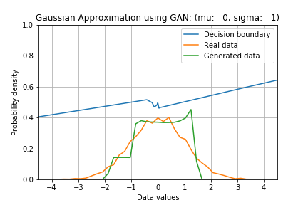
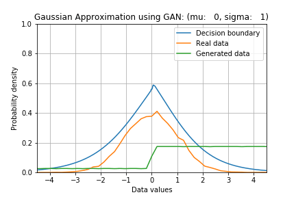

# Tutorial: A simple GAN to generate samples from Gaussian distribution
PyTorch implementation. More details can be seen in the medium article here:

* Environment used:
    * torch 1.1.0
    * numpy 1.17.3
    * python 3.7.3

## Learn sampling from 1D Gaussian distribution
### Network architecture
* Generator
    * hidden layer: Fully-connected (32 nodes), ReLU activation
    * output layer: Fully-connected (1 node), no activation

* Discriminator
    * hidden layer: Fully-connected (32 nodes), ReLU activation
    * output layer: Fully-connected (1 node), Sigmoid activation
    
### Results
* For mu = 0.0, sigma = 1.0:
    * After 1 epoch,  
      
    * Afrer 2000 epochs,  
      
    * Whole training evolution,  
      
      
### Further improvements
* minibatch feature
* WGAN implementation
* WGAN-GP implementation

### References
1. https://github.com/togheppi/vanilla_GAN
2. https://github.com/ericjang/genadv_tutorial/blob/master/genadv1.ipynb
3. https://machinelearningmastery.com/how-to-develop-a-generative-adversarial-network-for-a-1-dimensional-function-from-scratch-in-keras/
4. https://blog.aylien.com/introduction-generative-adversarial-networks-code-tensorflow/
5. https://github.com/kremerj/gan
6. https://github.com/igul222/improved_wgan_training
7. https://github.com/AYLIEN/gan-intro/blob/master/gan.py
